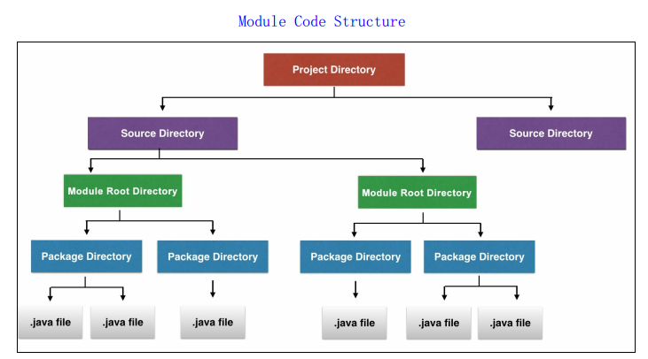
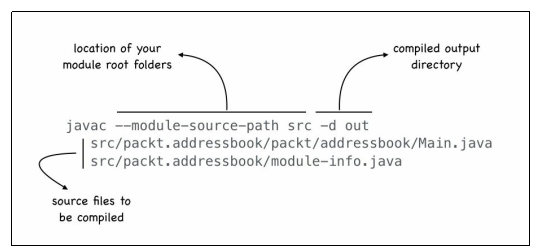
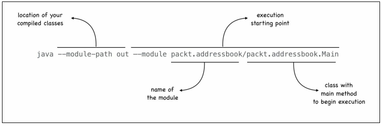
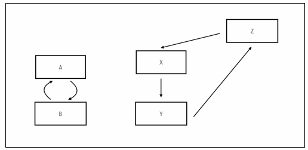
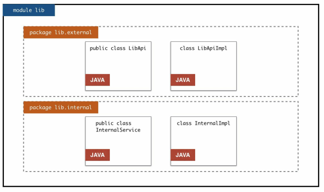
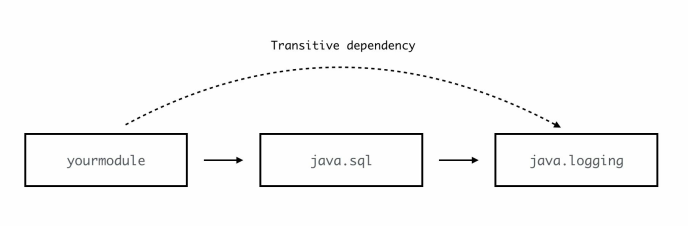

## Modularity in Java

Why use Java 9 Module? 

#### 1. Java 9 Module can encapsulate internal types (internal API)

Jack has `acme.util.stringsorter.StringSorterUtil` and `acme.util.stringsorter.interna.BubbleSortUtil`. StringSorterUtil uses BubbleSortUtil to sort. Jack shares `acme.util.stringsorter` inside  JAR with colleagues. His colleagues are only supposed to use`StringSorterUtil`, but some saw `BubbleSortUtil` and went ahead and used it. when Jack wanted to replace BubbleSortUtil with hash sort, those who used `BubbleSortUtil` had their code failed. Jack had to put `BubbleSortUtil` back.

a class's modifier can only be public or default. If you don't want others to use `BubbleSortUtil`, you have to put it inside the same package with `StringSorterUtil`

Java 9 Module solves this problems by hiding `BubbleSortUtil` inside the module. It is not exported, therefor not exposed.

#### 2. Java 9 Module makes application more reliable

1. 没有运行到需要 没加上的JAR包里的类 的类时, 不会意识到缺包了
2. 当有重复的不同版本的类时, 第一个副本会被使用

#### 3. Java 9 Module 

Once a class is in classpath, it's free for all. Developer may use a type they are not supposed to, or a type that might be available at compile time, but not at deployment/runtime. 

Multiple copies or multiple versions of same class in 2 different classpath locations.making it unpredictable which version the runtime will pick up during execution. JAR Hell.

This is especially obvious for rt.jar. `sun.misc.Unsafe` contains low-level unsafe operations.Despite warnings, many developers use its methods

#### Java Platform Module System(JPMS)

benefits:

1. String encapsulation
2. Reliable Configuuration
3. Scalable and easy to use

####Project Jigsaw

1. Scalable platform
   1. Move away from a **monolithic runtime** and enabling the ability to scale the platform down to **smaller computing devices**
2. Security and maintainability
   1. Better organizational code make it more maintainable. Hiding internal API improves security
3. Improved application performance
   1. Smaller platform with only necessary runtimes, rusulting into faster perfomance
4. Easier developer experience 
   1. The combination of modular system and the modular platform makes it easier to develop applications and libraries

## Creating Your First Java Module

### Java 9 Modules

#### What is a module

A Java 9 module is a named, self-describing collection of code and data that you can create and use in Java applications. It can contain packages(containing classes and interface) as well as **resource files or property files**

They are like **building blocks**: can exist on its own and be a part of a bigger whole

#### Creating a module

1. assign a module name (reverse domain name pattern, all lowercase)

2. create a module root folder `source folder > module root folder > package folder`

3. add the module code

   

   1. create and configure the module descriptor

      1. name is module-info.java
      2. located inside module root folder
      3. contains the metadata(inputs and outputs)

      ```java
      module com.my.module.name{
          
      }
      ```

   #### Creating your first Java module

   ##### Compiling your module

   

   ##### Executing your module

   

   `D:\programs\java\jdk-11.0.2\bin\java --module-path out --module packt.addressbook/packt.addressbook.Main`

### Creating a module using Netbeans

### The address book viewer application P83

You dont have to list all classes by their paths to compile them, just use the module name:

`because netbeans's fold structure is src/[module_name]/classes/module.info.java
I used D:\programs\java\jdk-11.0.2\bin\javac -d out --module-source-path src\*\classes -m packt.addressbook`


> As per [JEP 261](http://openjdk.java.net/jeps/261) the `--module-source-path` option (for compilation in "multi-module mode") must point to a directory that holds one subdirectory for each contained module, where the directory name must equal the module name.
>
> To accommodate layouts where sources are not directly contained in the module directory, the option supports *patterns* where the token `*` can be used to represent the module name in any part of the path such as in `"./*/src/main/java/"`, which will find the module `my.mod1` in `./my.mod1/src/main/java/module-info.java` etc.
>
> JEP 261 does not mention any contraints on where in the pattern `*` may occur, but apparently `javac` doesn't like patterns *starting* with `*`. This may or may not be intentional.
>
> >https://stackoverflow.com/a/49544403

## Handling Inter-Module Dependencies

#### Compiling two modules

`D:\programs\java\jdk-11.0.2\bin\javac -d out --module-source-path src\*\classes -m packt.addressbook,packt.sortutil`

#### Configure module dependency

#### Revisiting the classpath problems

At compilation, initialization and exe

cution, the compiler or runtime checks module-info.java or module-info.class to check if a dependent module is missing and shows the name of missing module

## Introducing the Modular JDK

### Examining the legacy JDK

You dont have to package the core java library classes you rely on like collections and threads because every runtime has rt.jar, which contains all compiled classes in the Java platform. The size of rt.jar is about 60M. 

#### Browsing modules

```
java --list-modules //list observable modules and exit
java --describe-module 
```

## Using Platform APIs

### Adding logging ability

#### Using an alternate compiler command

linux only:

```sh
javac --module-source-path src -d out $(find . -name '*.java')
```

Circular dependency



## Module Resolution, Readability, and Accessibility

### Readability

`requires` grands the readability between modules.

It is directional.

### Accessibility

Accessibility is between modules and types. We say a type is accessible in a module

For a type t in module B to be accessible in module A:

1. A needs to read B
2. B needs to export the package that contains t
3. t needs to be public

#### Interface and Implementation accessibility



**public** LibApi:

```java
package packt.lib.external;
public interface LibApi {
    static LibApi createInstance() {
        return new LibApiImpl();
    }
    public void testMethod();
}
```

**default** LibApiImpl

```java
package packt.lib.external;

class LibApiImpl implements LibApi {
	public void testMethod() {
		System.out.println("test method executed");
	}
}
```

App from another module:

```java
package packt.app;
import packt.lib.external.LibApi;

public class App {
    public static void main(String[] args){
        //This will not work because LibApiImpl is not accessible
        //LibApiImpl api = new LibApiImpl();
        //api.testMethod();

        //This will work
        LibApi api = LibApi.createInstance();
        api.testMethod();
    }
}

```

#### Split packages

Given a package in an application, it should be a part of **one and only one** module on the module path. Modules do not allow *sharing* of packages or *split packages*.

However, multiple jars in the class path can contain the same package. 

### Tweaking Modularity

#### Implied readability

```java
module java.sql{
    ...
    requires transitive java.logging;
    ...
}
```




#### Aggregator modules

- Defeats the purpose of modularity
- Mainly used for legacy code migration purposes like CORBA
- example: java.se.ee

#### Qualified exports

- Exports only to specified modules
- `exports <package-name> to <module1>, <module2>`
- not recommended
- adds a certain level of couping between 2 modules

## Introducing Service

### The problem of coupling

Modules are tightly coupled. A module is aware of the module it needs. 

### Creating and using services

Steps (using the project `p205_Implementing_sorting_services`)

1. Create a module containing the interface that defines the service

   module name: `packt.sortutil`
   packt.util.SortUtil:

   ```java
   public interface SortUtil {
   
       public <T extends Comparable> List<T> sortList(List<T> list);
   }
   
   ```

   module-info.java:

   ```java
   module packt.sortutil {
       exports packt.util;
   }
   ```

2. Create one or more implementation modules

   1. they require the interface module

      1. Make sure you dont put both the implementation classes in the 2 modules in the same package to avoid **split package**
         1. `packt.util.impl.bubblesort` and `packt.util.impl.javasort`

   2. register themselves as service providers

      syntax: provides <interface-type> with <implementation-type>`

   3. the interface type in `provides` does not belong to the modules itself, but there is `requires`

   4. Note the fully qualified name for both the interface and implementation types

      1. implementations modules doesn't need to export themselves, the consumer module will get the instance of the implementation through the service APIs

   packt.util.impl.bubblesort.BubbleSortUtilImpl:

   ```java
   package packt.util.impl.bubblesort;
   public class BubbleSortUtilImpl implements SortUtil {
   ...
   ```

   module-info.java:

   ```java
   module packt.sort.bubblesort {
       requires packt.sortutil;
       provides packt.util.SortUtil with packt.util.impl.bubblesort.BubbleSortUtilImpl;
   }
   ```

   3. Consumer register itself as a consumer of the service

      1. consumer module also `requires` interface modules
      2. formally declare the need to use the service
         1. syntax: `uses <interface-type>`

      ```java
      module packt.addressbook {
          requires packt.sortutil;
          uses packt.util.SortUtil;
      }
      ```

      3. Call the Service API to access the provider instances in the consumer module's code (this is **dependency lookup**, not dependency injection)

      ```java
      Iterable<SortUtil> sortUtils = ServiceLoader.load(SortUtil.class);
              for (SortUtil sortUtil : sortUtils){
                  System.out.println("Found an instance of SortUtil");
                  sortUtil.sortList(contacts);
              }
      ```

      

      3. 

